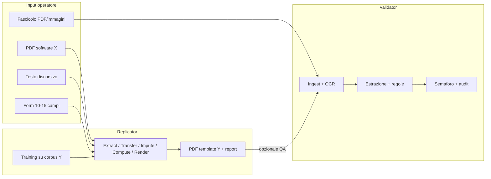

# Architettura prodotto — Validator + Replicator

> Traccia permanente dell’organizzazione approvata (2026-05-21).
> Da consultare **alla fine del corso** quando si costruiscono gli applicativi deployabili.

---

## 1) Principio: due applicativi, un dominio



| Aspetto | Validator | Replicator |
|---------|-----------|------------|
| Scopo | Trovare errori e incoerenze | Generare PDF fedeli al template Y |
| Relazione | Controlla anche output Replicator | Migliora se Validator segnala pattern |
| Deploy M10 | URL / servizio 1 | URL / servizio 2 |
| Codice | `aplicativo/validator/` | `aplicativo/replicator/` |

**Co-evoluzione antagonista:** Replicator massimizza somiglianza visiva; Validator massimizza rilevamento anomalie. Metriche condivise: `pratica_id`, `schema_canonico`, bundle `pdf + payload + imputation_report`.

---

## 2) Spettro documentale (10 tipi)

Fonte unica: [`DOCUMENT_SPECTRUM.md`](DOCUMENT_SPECTRUM.md).

**Regola di progetto:** non implementare tutti e 10 i tipi entro M10. Usare **P0 → P1 → P2**.

| Fase | Validator (target M10) | Replicator (target M10) |
|------|------------------------|-------------------------|
| **P0** | `busta_paga`, `cu`, `estratto_conto_corrente` | `busta_paga` con `transfer_xy` |
| **P1** | estensione controlli altri tipi | `cu` con `partial_inputs` + imputazione |
| **P2** | resto spettro | un tipo alla volta |

---

## 3) Modalità Replicator (tre ingressi)

| Modalità | Quando | Corpus X | Corpus Y |
|----------|--------|----------|----------|
| `transfer_xy` | Hai PDF da software X, vuoi template Y | Molti | Molti |
| `discursive` | Descrivi i dati a parole | No | Molti |
| `partial_inputs` | Compili solo campi chiave | No | Molti + imputazione |

**UX decisione:** generazione quasi automatica + **report campi imputati** + modifica prima del download (`auto_with_report`).

---

## 4) Pipeline Replicator (runtime)

1. **Extract** (solo transfer): PDF X → payload strutturato
2. **Transfer**: allineamento campi verso schema template Y (`schema_transfer_route_v01.json`)
3. **Impute**: campi mancanti da `imputation_profile` (condizionale → marginale)
4. **Compute**: totali e vincoli **solo Python** (mai LLM)
5. **Render**: strategia A (fill master) / B (overlay) / C (ReportLab da geometry)

**Training (offline):** profilo corpus → geometry_template → field_map → imputation_profile → QA hold-out (soglia placement ≥98% operativa, non clone forense).

---

## 5) Integrazione Validator ↔ Replicator

**Bundle minimo verso Validator:**

```json
{
  "pratica_id": "...",
  "doc_type_id": "busta_paga",
  "pdf_path": "...",
  "payload": {},
  "imputation_report": {
    "fields": [
      { "field_id": "...", "provenance": "imputed_conditional", "confidence": 0.82 }
    ]
  }
}
```

Validator §6.7: analisi dedicata su PDF generati (regole + confronto con report imputazione).

---

## 6) Gap analysis — cosa manca prima dello sviluppo “vero”

Checklist da completare **progressivamente nel corso** (non tutto in un colpo):

| # | Gap | Azione | Owner fase |
|---|-----|--------|------------|
| G1 | **Catalogo campi per tipo** | Tabella campi in `schema_canonico` + sezione §10 REPLICATOR per partial (10–15 campi) | M4–M5 |
| G2 | **Registry tipi** | `doc_type_registry.json` per route, modalità abilitate, versione template | M4 |
| G3 | **Motore imputazione** | Apprendimento su corpus Y + provenance + confidence | M5–M7 |
| G4 | **UI admin training** | Upload corpus, learn, attivazione versione template | M4 prototipo, M10 React |
| G5 | **Transfer X→Y** | `field_map` + route per busta P0 | M4–M6 |
| G6 | **Integrazione antagonista** | Export bundle + regole Validator su campi imputati | M7–M10 |
| G7 | **Compliance campi stimati** | Disclaimer UI, audit export, metadati PDF onesti | M10 |
| G8 | **Scope realistico M10** | Solo P0+P1 Replicator; altri tipi in P2 post-corso | Decisione fissa |

---

## 7) Cosa NON è obiettivo

- Clone PDF **forense** byte-identico o metadati falsificati del software Y
- Copertura **tutti e 10** i tipi in M10
- Tool **Fixer** (rimosso dal perimetro)
- LLM per **calcoli** fiscali/contabili (solo estrazione/interpretazione testo)

---

## 8) Definition of Done — fine corso (due app)

### Validator

- Ingest multi-formato; almeno P0 document types con regole e semaforo
- Audit trail e narrative per operatore
- Capacità di analizzare almeno un PDF generato da Replicator con report imputazione

### Replicator

- Admin training funzionante
- P0: `busta_paga` + `transfer_xy` con QA hold-out documentato
- P1: secondo tipo (es. `cu`) con `partial_inputs`
- Ogni PDF: `imputation_report.json` + provenance

### Portfolio

- Due demo deployate (URL separati o path distinti)
- Documentazione allineata a questo file e agli APPUNTI split

---

## 9) Roadmap moduli (sintesi)

| Modulo | Validator | Replicator |
|--------|-----------|------------|
| M1–M3 | Dati, ML, OCR | Path `dati/replica/`, metriche |
| M4 | Estrazione, regole | Learn layout, extract |
| M5 | NLP / RAG | Interpret discorsivo, imputazione v1 |
| M6–M7 | Agenti, orchestrazione | Pipeline tool + Streamlit |
| M8–M9 | Fine-tune (opz.), MLOps | CI, container |
| M10 | React + FastAPI deploy | Seconda app deploy + integrazione test |

---

## 10) Riferimenti file

- Indice: [`docs/prodotto/README.md`](README.md)
- Spec Validator: [`APPUNTI_APPLICATIVO_VALIDATOR.md`](APPUNTI_APPLICATIVO_VALIDATOR.md)
- Spec Replicator: [`APPUNTI_APPLICATIVO_REPLICATOR.md`](APPUNTI_APPLICATIVO_REPLICATOR.md)
- Corso: [`CONTESTO_CORSO.md`](CONTESTO_CORSO.md), [`roadmap_ai.md`](roadmap_ai.md)

---

## Decision log

| Data | Decisione |
|------|-----------|
| 2026-05-21 | Canonizzazione piano due app + gap analysis + fasi P0/P1/P2; antagonista Validator/Replicator. |
