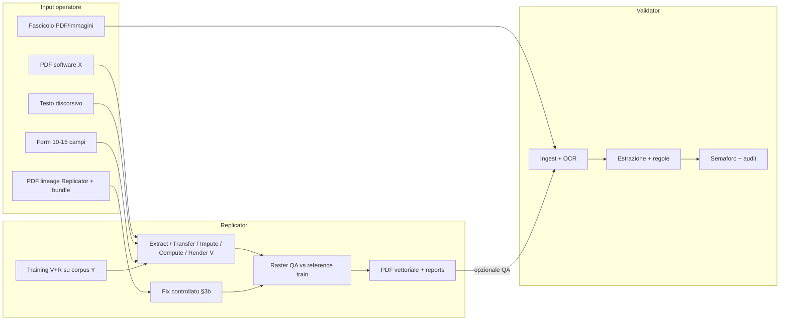

# Architettura prodotto — Validator + Replicator

> Traccia permanente dell’organizzazione approvata (2026-05-21).
> Da consultare **alla fine del corso** quando si costruiscono gli applicativi deployabili.

---

## 1) Principio: due applicativi, un dominio



| Aspetto | Validator | Replicator |
|---------|-----------|------------|
| Scopo | Trovare errori e incoerenze | Generare PDF **vettoriali** fedeli **a schermo** al template Y |
| QA qualità | Regole + geometria + (opz.) raster ingest | Dual-channel V+R post-render (§4.3 REPLICATOR) |
| Relazione | Controlla anche output Replicator | Migliora se Validator segnala pattern |
| Deploy M10 | URL / servizio 1 | URL / servizio 2 |
| Codice | `aplicativo/validator/` | `aplicativo/replicator/` + `replicator/fix/` (§3b) |

**Co-evoluzione antagonista (lab):** Replicator produce PDF **indistinguibili** da buste Y (`export_mode: stress_test` — canone [`CANONE_STRESS_TEST_LAB_VR.md`](CANONE_STRESS_TEST_LAB_VR.md)); Validator analizza **solo il PDF** (nessun bundle). Metriche condivise offline: `manifest_v01.csv`, `schema_canonico` per rule discovery. Bundle Replicator solo in cartella `internal/` (debug build).

**North Star operatore (esempio):** da N buste software X + richiesta NL (“buste Zucchetti + CU anno precedente”) → fascicolo PDF coerente (BP + CU) nella stessa pratica — dettaglio sequenza in REPLICATOR §1.1.

---

## 2) Spettro documentale (10 tipi)

Fonte unica: [`DOCUMENT_SPECTRUM.md`](DOCUMENT_SPECTRUM.md).

**Regola di progetto:** non implementare tutti e 10 i tipi entro M10. Usare **P0 → P1 → P2**.

| Fase | Validator (target M10) | Replicator (target M10) |
|------|------------------------|-------------------------|
| **P0** | `busta_paga`, `cu`, `estratto_conto_corrente` | `busta_paga` con `transfer_xy` |
| **P1** | estensione controlli altri tipi | `cu` con `partial_inputs` + imputazione |
| **P2** | resto spettro | altri tipi + **`controlled_fix`** maturo (§3b) |

---

## 3) Modalità Replicator (ingressi)

| Modalità | Quando | Corpus X | Corpus Y |
|----------|--------|----------|----------|
| `transfer_xy` | Hai PDF da software X, vuoi template Y | Molti | Molti |
| `discursive` | Descrivi i dati a parole | No | Molti |
| `partial_inputs` | Compili solo campi chiave | No | Molti + imputazione |
| `controlled_fix` | Correggi un PDF **già generato** dal Replicator (lineage + bundle) — §3b [`APPUNTI_APPLICATIVO_REPLICATOR.md`](APPUNTI_APPLICATIVO_REPLICATOR.md) | n/a | stesso template usato in origine |

**UX decisione:** generazione quasi automatica + **report campi imputati** + modifica prima del download (`auto_with_report`).

---

## 4) Pipeline Replicator (runtime)

1. **Extract** (solo transfer): PDF X → payload strutturato
2. **Transfer**: allineamento campi verso schema template Y (`schema_transfer_route_v01.json`)
3. **Impute**: campi mancanti da `imputation_profile` (condizionale → marginale)
4. **Compute**: totali e vincoli **solo Python** (mai LLM)
5. **Render (vettoriale)**: strategia A (fill master) / B (overlay) / C (ReportLab da geometry)
6. **Raster QA**: rasterizza output → confronto con `raster_reference` del train → `dual_channel_qa_report` → release solo se `passed`

**Training (offline):** profilo corpus → geometry_template → **raster_reference** (maschere + ROI) → field_map → imputation_profile → QA hold-out **dual-channel** (placement vettoriale ≥98% **e** soglie raster — vedi REPLICATOR §4.3).

**Obiettivo visivo:** identico **a schermo** rispetto al cluster di training (es. Zucchetti); **non** clone forense byte-identico né metadati falsificati.

### 4b) Ramo Fix (modalità `controlled_fix`)

Ingresso: PDF con **lineage** Replicator + `payload.json` (e report) della stessa `pratica_id` / `replicator_run_id`.

1. **Validazione lineage** (metadati PDF o sidecar JSON firmato dal motore)
2. **Strategia preferita:** aggiornare `payload` → **rigenerazione completa** da Render (stesso template_version) — massima tracciabilità
3. **Strategia alternativa (P2):** patch vettoriale consentita solo su **allowlist** di `field_id` (sostituzione testo in bbox note da `geometry_template`); **mai** LLM su coordinate o totali
4. **Compute** se cambiano importi (solo Python)
5. **Raster QA** obbligatorio; append **`fix_report.json`** (chi/cosa/quando, diff payload)

Dettaglio vincoli e tier: **REPLICATOR §3b**.

---

## 5) Integrazione Validator ↔ Replicator

> **Canone stress test (vince su sezioni precedenti):** [`CANONE_STRESS_TEST_LAB_VR.md`](CANONE_STRESS_TEST_LAB_VR.md)

### 5.1 Produzione e lab — Validator vede solo PDF

| Ingresso Validator | Uso |
|--------------------|-----|
| PDF cliente | Produzione |
| PDF da `Replicator` cartella **`stress_test/`** | Lab — **stesso ingest**, nessun trattamento speciale |

**Vietato** in ingest / training / scoring Validator: `payload`, `imputation_report`, `dual_channel_qa_report`, `fix_report`, lineage, etichette nel PDF.

### 5.2 Replicator — due export

| `export_mode` | Contenuto | Destinazione |
|---------------|-----------|--------------|
| **`stress_test`** | Solo PDF (`metadata_mimic_y`, layout QA interno già passato) | Ingest Validator |
| **`internal`** | PDF + bundle JSON + report QA + lineage | `dati/lab/.../internal/` — debug, **non** Validator |

**Bundle interno (riferimento build, non ingest Validator):**

```json
{
  "pratica_id": "...",
  "replicator_run_id": "...",
  "export_mode": "internal",
  "payload": {},
  "imputation_report": {},
  "dual_channel_qa_report": { "passed": true, "channels_agree": true },
  "fix_report": []
}
```

Schema raster: [`schema_raster_reference_v01.json`](../../schema_raster_reference_v01.json).

### 5.3 Loop antagonista (lab) — protocollo 8 step

> [`PROTOCOLLO_LOOP_ANTAGONISTA_VR.md`](PROTOCOLLO_LOOP_ANTAGONISTA_VR.md) · esempi: [`examples/evasion_report.example.json`](examples/evasion_report.example.json), [`examples/rule_candidates.example.yaml`](examples/rule_candidates.example.yaml)

| Step | Output chiave |
|------|---------------|
| 1 | `manifest_v01.csv` (etichette **solo** qui) |
| 2 | Replicator → `stress_test/*.pdf` + `internal/` bundle |
| 3–4 | Validator **solo PDF** → `evasion_report.json` |
| 5–7 | `rule_candidates.yaml` → regole approvate |
| 8 | Profili stress + `metadata_mimic_y` |

**KPI lab:** `evasion_rate` ↓ · Validator più forte · PDF senza inghippo Replicator.

---

## 6) Gap analysis — cosa manca prima dello sviluppo “vero”

Checklist da completare **progressivamente nel corso** (non tutto in un colpo):

| # | Gap | Azione | Owner fase |
|---|-----|--------|------------|
| G1 | **Catalogo campi per tipo** | Tabella campi in `schema_canonico` + sezione §10 REPLICATOR per partial (10–15 campi) | M4–M5 |
| G2 | **Registry tipi** | `doc_type_registry.json` per route, modalità abilitate, versione template | M4 |
| G3 | **Motore imputazione** | Apprendimento su corpus Y + provenance + confidence | M5–M7 |
| G4 | **UI admin training** | Upload corpus, learn, attivazione versione template | M4 prototipo, M10 React |
| G5 | **Transfer X→Y** | `field_map` + route per busta P0 | M4–M6 |
| G6 | **Integrazione antagonista** | `export_mode` stress_test vs internal; Validator solo PDF; manifest lab | M5–M10 |
| G7 | **Compliance campi stimati** | Disclaimer UI; audit in `internal/` + manifest; `metadata_mimic_y` solo lab | M10 |
| G8 | **Scope realistico M10** | Solo P0+P1 Replicator; altri tipi in P2 post-corso | Decisione fissa |
| G9 | **Dual-channel QA (V+R)** | `raster_reference` + gate post-render + bundle `dual_channel_qa_report` | M4–M7 train; M7–M10 runtime |
| G10 | **Fixer controllato** | Modulo `controlled_fix`: lineage + bundle + `fix_report`; preferenza rigenerazione; allowlist patch P2 | M6–M10 |
| G11 | **Loop antagonista V↔R** | Protocollo 8 step, `evasion_report`, `rule_candidates`, job discovery gen vs alt | M5–M7 lab; M10 UI review |

---

## 7) Cosa NON è obiettivo

- Clone PDF **forense** byte-identico per frode su **terzi** in produzione
- Passare **bundle** Replicator al Validator per training/scoring (vedi canone stress test)
- Copertura **tutti e 10** i tipi in M10
- **Fixer “libero”** su PDF **terzi** senza lineage né audit — **vietato**
- LLM per **calcoli** fiscali/contabili (solo estrazione/interpretazione testo)

**È obiettivo lab** ([`CANONE_STRESS_TEST_LAB_VR.md`](CANONE_STRESS_TEST_LAB_VR.md)): PDF stress test con `metadata_mimic_y` e layout indistinguibile; fedeltà visiva + QA raster **interno** prima dell’export `stress_test`.

**È invece obiettivo (Replicator §3b):** **Fixer controllato** — correzione solo su output con **provenienza Replicator** + bundle + report append-only + QA V+R ripetuto.

---

## 8) Definition of Done — fine corso (due app)

### Validator

- Ingest multi-formato; almeno P0 document types con regole e semaforo
- Audit trail e narrative per operatore
- Capacità di analizzare almeno un PDF generato da Replicator con report imputazione

### Replicator

- Admin training funzionante
- P0: `busta_paga` + `transfer_xy` con QA **dual-channel** documentato (V+R)
- P1: secondo tipo (es. `cu`) con `partial_inputs`
- Ogni PDF: `imputation_report.json` + `dual_channel_qa_report.json` + provenance
- (Opzionale M10) **Chat** come UX primaria: stessa pipeline, ciclo miglioramento A/B/C — vedi REPLICATOR §7.3
- **Fixer controllato** (`controlled_fix`): lineage + bundle + `fix_report` + QA V+R — vedi REPLICATOR §3b (target **P2** post-P0 generazione stabile)

### Portfolio

- Due demo deployate (URL separati o path distinti)
- Documentazione allineata a questo file e agli APPUNTI split

---

## 9) Roadmap moduli (sintesi)

| Modulo | Validator | Replicator |
|--------|-----------|------------|
| M1–M3 | Dati, ML, OCR | Path `dati/replica/`, metriche |
| M4 | Estrazione, regole; ingest dual-channel opz. | Learn layout (V) + raster_reference (R), extract |
| M5 | NLP / RAG | Interpret discorsivo, imputazione v1 |
| M6–M7 | Agenti, orchestrazione | Pipeline tool + Streamlit; **chat + agente** (§7.3 REPLICATOR); **fix controllato** (§3b) |
| M8–M9 | Fine-tune (opz.), MLOps | CI, container |
| M10 | React + FastAPI deploy | Seconda app deploy + integrazione test |

---

## 10) Riferimenti file

- Indice: [`docs/prodotto/README.md`](README.md)
- Spec Validator: [`APPUNTI_APPLICATIVO_VALIDATOR.md`](APPUNTI_APPLICATIVO_VALIDATOR.md)
- Spec Replicator: [`APPUNTI_APPLICATIVO_REPLICATOR.md`](APPUNTI_APPLICATIVO_REPLICATOR.md)
- Corso: [`CONTESTO_CORSO.md`](CONTESTO_CORSO.md), [`roadmap_ai.md`](roadmap_ai.md)

---

## Decision log

| Data | Decisione |
|------|-----------|
| 2026-05-21 | Canonizzazione piano due app + gap analysis + fasi P0/P1/P2; antagonista Validator/Replicator. |
| 2026-05-21 | Dual-channel QA (vettoriale + raster): fedeltà visiva prioritaria; schema `schema_raster_reference_v01.json`; gap G9. |
| 2026-05-21 | UX **chat** Replicator + ciclo miglioramento (livelli A/B/C): `APPUNTI_APPLICATIVO_REPLICATOR.md` §7.3; DoD M10 opzionale. |
| 2026-05-22 | **Fixer controllato** reintrodotto: modalità `controlled_fix` (§3b REPLICATOR), ramo arch §4b, gap **G10**; divieto fix “libero” su PDF terzi. |
| 2026-05-22 | **Loop antagonista** documentato: `PROTOCOLLO_LOOP_ANTAGONISTA_VR.md` §5b arch; evasion + rule_candidates; gap **G11**; mining contrastivo genuine vs alterate. |
| 2026-05-22 | **Canone stress test:** `CANONE_STRESS_TEST_LAB_VR.md` — Validator solo PDF; `export_mode` stress_test/internal; `metadata_mimic_y` lab; bundle vietato in Validator. |
