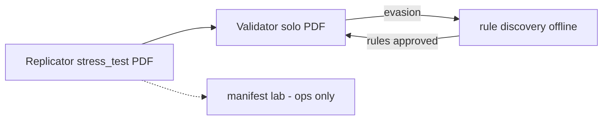

# Canone — Stress test lab Validator ↔ Replicator

> **Fonte di verità** (decisione 2026-05-22) per eliminare contraddizioni tra architettura, bundle, metadati e loop antagonista.
>
> **Regola per agenti:** in caso di conflitto con sezioni vecchie di APPUNTI/ARCHITETTURA, **questo file vince** sul perimetro lab + ingest Validator.

**Riferimenti operativi:** [`PROTOCOLLO_LOOP_ANTAGONISTA_VR.md`](PROTOCOLLO_LOOP_ANTAGONISTA_VR.md) · [`ARCHITETTURA_PRODOTTO_DUE_APP.md`](ARCHITETTURA_PRODOTTO_DUE_APP.md) §5

---

## 1) Obiettivo North Star (lab)

**Replicator** produce PDF da sottoporre a **Validator come buste normali** — stress test **cieco** e completo.

**Validator** si addestra e valuta **solo dal PDF** (stesso pipeline OCR/estrazione/regole/ML del cliente). **Nessuna** informazione aggiuntiva Replicator in ingest, training o scoring.

**Successo del ciclo:** Validator più forte (recall alterate ↑, evasion ↓). **Non** “tutte le repliche passano”.

---

## 2) Due contesti export Replicator (non confonderli)

| Contesto | `export_mode` | Cosa esce | Chi lo consuma |
|----------|---------------|-----------|----------------|
| **Stress test lab** | `stress_test` | **Solo PDF** in cartella ingest Validator | Validator (cieco) |
| **Build interno** | `internal` | PDF + `payload` + report QA + lineage in `dati/lab/.../internal/` | Team / Replicator debug — **mai** in pipeline Validator |

```text
Replicator run
    ├── stress_test/     →  busta.pdf          →  Validator (unico ingresso)
    └── internal/        →  bundle + manifest  →  ops / QA Replicator (vietato a Validator)
```

---

## 3) Regole PDF per `export_mode: stress_test`

Il PDF deve essere **il più simile possibile** a un export Zucchetti reale, altrimenti Validator trova subito l’**inghippo** (indizio banale) e il test non vale.

| Aspetto | Obbligo stress test |
|---------|---------------------|
| **Layout / font / vettoriale** | Allineato a `template_version` train (dual-channel QA **interno** prima dell’export) |
| **Metadati PDF** (`Creator`, `Producer`, `CreationDate`, …) | Profilo **`metadata_mimic_y`** — coerenti con cluster corpus Y (es. Zucchetti), **senza** firma “Replicator” nel file |
| **Struttura file** | Stessa “classe” del cliente (PDF nativo vs scansione come nel corpus) |
| **Tracce lab nel PDF** | **Vietate:** XMP `ReplicatorRunId`, watermark debug, commenti “generated by…” |

**Tracciabilità lab (fuori dal PDF):** `manifest_v01.csv` con `pdf_sha256`, `replicator_run_id`, `stress_profile_id`, `y_altered`, `source=lab` — solo per ops e rule discovery offline, **non** passate a Validator.

### 3.1 Chiarimento su “metadati falsificati”

| Contesto | Metadati PDF |
|----------|----------------|
| **Produzione / uso esterno fraudolento** | **Vietato** fingere software Y per ingannare terzi |
| **Lab stress test** (`stress_test`) | **Consentito** `metadata_mimic_y` **solo** su dataset interno `dati/lab/` per parità con PDF cliente — con audit manifest e policy accesso |

Non è clone byte-identico forense: è **indistinguibilità operativa** per Validator che vede solo il file.

---

## 4) Validator — perimetro cieco

| Consentito | Vietato in training / scoring / produzione |
|------------|---------------------------------------------|
| Ingest PDF | `payload.json`, `imputation_report`, `dual_channel_qa_report`, `fix_report` |
| Estrazione OCR/LLM **dal PDF** | Feature da provenance imputazione |
| Regole su campi estratti | Regole su `channels_agree` (solo esisteva nel bundle) |
| ML su feature da PDF | Etichette `y_altered` **dentro** il PDF |

**Etichette** (`genuina` / `alterata`): solo in `manifest_v01.csv` (o DB lab), mai nel file sottoposto a Validator.

**Canale debug (opzionale M10+):** analisi bundle Replicator per **sviluppatori** in UI separata — **esclusa** da score semaforo e da training. Vedi Validator §6.7-nota.

---

## 5) Replicator — ottimizzato per stress test

Priorità engineering (ordine):

1. **`metadata_mimic_y`** + layout raster/vettoriale QA **interno** gate.
2. Profili mutazione **`realistic_full`** (frode credibile: totali coerenti, numeri fuori storico).
3. Profili **`lazy_fraud`** (baseline: totali non tornano) — minoranza del batch.
4. Export pulito: **una busta = un PDF** in `stress_test/` senza sidecar nella stessa cartella ingest.

**Non** ottimizzare per: massimizzare pass rate Validator, eludere regole, pulire PDF cliente.

---

## 6) Sinergia antagonista (riformulata)



1. Replicator genera PDF (`stress_profile_id`, `metadata_mimic_y`).
2. PDF in Validator **come qualsiasi busta**.
3. Evasion → rule discovery (feature **solo da PDF** estratti su genuine vs alterate).
4. Regole approvate → Validator produzione + lab replay.

---

## 7) Profili stress (minimo)

Vedi [`../../aplicativo/replicator/lab/stress_profiles_v01.json.example`](../../aplicativo/replicator/lab/stress_profiles_v01.json.example).

| `stress_profile_id` | Uso |
|---------------------|-----|
| `realistic_full` | **Default** — meta mimic Y + mutazione numerica “furba” |
| `lazy_fraud` | Controllo regole P0 (somme) |
| `visual_only` | Solo se P2 patch allowlist — raro |

Ogni run dichiara `export_mode: stress_test` e `metadata_profile: mimic_y`.

---

## 8) Checklist pre-invio a Validator

- [ ] PDF in `dati/lab/antagonist/.../stress_test/*.pdf` — **nessun** JSON nella stessa directory ingest
- [ ] Metadati PDF ispezionati: nessuna stringa “Replicator”
- [ ] Layout passa QA raster **interno** (report in `internal/`, non allegato)
- [ ] `manifest_v01.csv` aggiornato con etichetta e `replicator_run_id`
- [ ] Split clienti rispettato per valutazione

---

## 9) Decision log

| Data | Decisione |
|------|-----------|
| 2026-05-22 | Canone stress test: Validator **solo PDF**; Replicator `export_mode` stress_test vs internal; `metadata_mimic_y` in lab; bundle **vietato** in pipeline Validator; tracciabilità solo manifest. |
