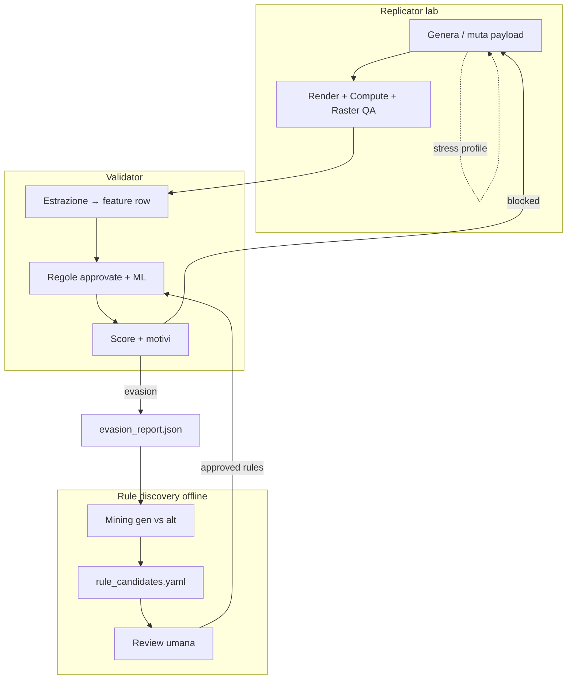

# Protocollo loop antagonista Validator ↔ Replicator

> **Scopo:** stress-test controllato in **lab** — Replicator genera alterate realistiche; Validator le analizza **solo come PDF**; evasion → nuove regole. **Non** far passare le frodi in produzione.
>
> **Canone (fonte di verità):** [`CANONE_STRESS_TEST_LAB_VR.md`](CANONE_STRESS_TEST_LAB_VR.md)  
> **Riferimenti:** [`ARCHITETTURA_PRODOTTO_DUE_APP.md`](ARCHITETTURA_PRODOTTO_DUE_APP.md) §5 · REPLICATOR §8b · VALIDATOR §6.8

---

## 1) Principi (non negoziabili)

| # | Regola |
|---|--------|
| P1 | Solo dataset **interno** (`dati/lab/antagonist/`) — mai fix silenzioso su PDF **cliente**. |
| P2 | Validator ingest **solo PDF** da `stress_test/` — **nessun** JSON/bundle in pipeline scoring/training. |
| P3 | Lineage + bundle solo in `internal/` + `manifest_v01.csv` (ops) — **non** visibili a Validator. |
| P4 | PDF stress test: **`metadata_mimic_y`**, layout QA interno — nessun inghippo “Replicator” nel file. |
| P5 | **Successo** = Validator **più forte** (recall ↑, evasion ↓), non pass rate alterate ↑. |
| P6 | Regole approvate solo dopo review da `rule_candidates.yaml`. |
| P7 | Feature rule discovery = estrazione **dal PDF** (stesso motore produzione). |
| P8 | Mining contrastivo: genuine vs alterate (etichette solo in manifest). |

---

## 2) Diagramma del ciclo

---

## 3) Protocollo operativo — 8 step

### Step 1 — Preparare corpus e split

**Input:** genuine Zucchetti (originali cliente + storico lab), alterate controllate (20–30+), template `busta_paga` addestrato.

**Azioni:**

- Etichettare ogni riga: `y_genuine=0` | `y_altered=1`, `source=client|lab`, `cliente_id`, `template_id`.
- Split **per `cliente_id`** (es. 4 clienti hold-out test) — mai ottimizzare regole sullo stesso cliente usato in test.
- Definire **feature table** minima (vedi §5).

**Output:** `dati/lab/antagonist/manifest_v01.csv`

---

### Step 2 — Replicator: generare batch alterate (red team)

**Input:** payload genuine (da corpus o generazione da X) + profilo mutazione `stress_profile_id`.

**Profili mutazione (esempi):**

| `stress_profile_id` | Cosa muta | Obiettivo test |
|---------------------|-----------|----------------|
| `netto_only` | Solo netto in evidenza, dettaglio vecchio | Frode “pigra” |
| `coherent_compute` | Netto/lordo coerenti internamente ma fuori storico | Eludere regole somme |
| `visual_micro` | Patch minima post-render (solo P2 allowlist) | Stress raster |
| `imputation_edge` | Campi imputati estremi ma plausibili | Test provenance |

**Azioni:**

- `Compute` obbligatorio se cambiano numeri.
- `dual_channel_qa_report` obbligatorio **interno** (gate qualità pre-export).
- `export_mode: stress_test` + `metadata_profile: mimic_y`.
- Checklist canone §8 prima di copiare PDF in ingest Validator.

**Output per run:**

- `.../runs/{run_id}/stress_test/*.pdf` → **unico** input Validator
- `.../runs/{run_id}/internal/` (payload, report, lineage) → **non** Validator

---

### Step 3 — Validator: scoring su tutto il batch

**Input:** bundle Step 2 + genuine hold-out (stesso pipeline estrazione).

**Azioni:**

- **Solo file PDF** — come busta cliente (Validator **cieco**).
- Estrazione OCR/LLM → JSON canonico (stesso motore produzione).
- Applica `rules_approved_v*.yaml` + ML (se presente).
- Registra score, semaforo, `rules_fired[]`, feature snapshot.

**Output:** `dati/lab/antagonist/runs/{run_id}/validator_scores.jsonl`

---

### Step 4 — Classificare esito: blocked vs evasion

**Regole:**

| Esito | Condizione | Azione |
|-------|------------|--------|
| `blocked` | `y_altered=1` e (semaforo rosso/giallo **oppure** score ≥ soglia) | OK difesa — log metriche |
| `evasion` | `y_altered=1` e semaforo verde / score < soglia | **Allarme** — apri evasion |
| `false_positive` | `y_genuine=0` e semaforo rosso | Regola troppo aggressiva — ticket |

**Output:** [`examples/evasion_report.example.json`](examples/evasion_report.example.json) (uno per `run_id`)

---

### Step 5 — Rule discovery contrastivo (IA + statistiche)

**Input:** feature table (genuine pool + alterate storiche + evasion Step 4), `evasion_report.json`.

**Azioni (offline, mensile o post-run):**

1. Calcola invarianti su **genuine** (supporto ≥ 85%).
2. Calcola violazione su **alterate** e **evasion** (≥ 60% per candidato forte).
3. Albero depth ≤ 3 o test univariati → regole leggibili.
4. LLM **redige** bozza in YAML (non approva).
5. Priorità a pattern che separano **evasion** nuove vs regole già esistenti.

**Output:** [`examples/rule_candidates.example.yaml`](examples/rule_candidates.example.yaml)

---

### Step 6 — Review umana e promozione regole

**Input:** `rule_candidates.yaml`

**Azioni:**

- Per ogni candidato: approva / rifiuta / `deferred`.
- Test su hold-out clienti + 20–30 alterate storiche.
- Versiona `rules_approved_v{semver}.yaml` in `aplicativo/validator/rules/`.

**Criterio promozione minimo:**

- Recall alterate (storico + lab) **non peggiora** vs versione precedente.
- Falsi positivi su genuine hold-out **sotto soglia** concordata (es. ≤ 5%).

---

### Step 7 — Ottimizzare Validator (blue team)

**Input:** evasion + regole approvate Step 6.

**Azioni:**

- Deploy regole nuove in Validator lab.
- (Opz.) Riaddestra ML su feature + etichette `y_altered` (include evasion come hard negatives).
- Riesegui Step 3–4 sullo **stesso** `run_id` (replay) — evasion dovrebbe ↓.

**KPI:** `evasion_rate`, `recall_altered`, `fp_rate_genuine`.

---

### Step 8 — Feedback a Replicator (realismo, non elusione)

**Input:** metriche Step 7, profili mutazione.

**Azioni:**

- Se evasion era `coherent_compute` → Replicator continua a produrre varianti **realistiche** per test; **non** si abbassa soglia Validator.
- Se batch fallisce **Raster QA** → migliora template/render (qualità), non frode.
- Aggiorna `stress_profiles.json` con mutazioni che **riflettono frodi viste in campo** (da alterate cliente 20–30).
- Documentare in decision log se un profilo è deprecato.

**Obiettivo Replicator nel loop:** dataset lab sempre più **simile al mondo reale**, non “battere” Validator.

---

## 4) Artefatti e path

| Artefatto | Path suggerito | Produttore |
|-----------|----------------|------------|
| Manifest corpus | `dati/lab/antagonist/manifest_v01.csv` | Ops / ingest |
| Run Replicator | `dati/lab/antagonist/runs/{run_id}/` | Replicator |
| Score Validator | `.../validator_scores.jsonl` | Validator |
| Evasion report | `.../evasion_report.json` | Validator (post-process) |
| Regole candidate | `dati/lab/antagonist/rule_candidates_{date}.yaml` | Rule discovery job |
| Regole approvate | `aplicativo/validator/rules/rules_approved_v*.yaml` | Review umana |
| Stress profiles | `aplicativo/replicator/lab/stress_profiles_v01.json` | Prodotto |

---

## 5) Feature table minima (rule discovery)

Colonne consigliate per ogni `pratica_id` (da JSON canonico + derivate):

| Feature | Tipo | Note |
|---------|------|------|
| `lordo`, `netto`, `trattenute_totali` | float | P0 |
| `delta_somme` | abs(lordo - netto - trattenute) | P0 |
| `rapporto_netto_lordo` | float | P0 |
| `template_id` | cat | Per regole condizionate |
| `mese`, `anno` | int | Stagionalità |
| `ocr_confidence_media` | float | Qualità ingest |
| `coerenza_voci_dettaglio` | bool | Se estrazione righe |
| `channels_agree` | bool | Solo `internal/` — **non** feature Validator |
| `y_altered`, `source` | label/meta | Non usare in runtime |

---

## 6) KPI del loop

| Metrica | Formula / senso | Target direzione |
|---------|-----------------|------------------|
| `recall_altered` | alterate bloccate / tot alterate | ↑ |
| `evasion_rate` | evasion / tot alterate lab | ↓ |
| `fp_rate_genuine` | FP / tot genuine test | ↓ (sotto cap) |
| `rules_promoted` | regole approved per trimestre | pochi ma forti |
| `mean_score_genuine` | calibrazione | stabile |
| `raster_qa_pass_rep` | qualità Replicator | ↑ (separato da frode) |

**North star lab:** evasion ↓ nel tempo **a parità** di `fp_rate_genuine`.

---

## 7) Fasi corso / prodotto

| Fase | Contenuto loop |
|------|----------------|
| **Ora (M3)** | Corpus 100 gen + 25 alt; regole P0 manuali; evasion_report a mano |
| **M5–M6** | Rule discovery batch + `rule_candidates.yaml` |
| **M7** | Automazione Step 2–4 (script / agente lab) |
| **M10** | UI review regole + dashboard KPI antagonista |

Gap architettura: **G11** in [`ARCHITETTURA_PRODOTTO_DUE_APP.md`](ARCHITETTURA_PRODOTTO_DUE_APP.md) §6.

---

## 8) Divieti espliciti

- Usare evasion per **pulire** PDF cliente in produzione.
- Auto-promuovere regole senza review.
- Ottimizzare Replicator per massimizzare `pass_rate` su Validator lab.
- Mescolare PII cliente in repo git senza policy.

---

## Decision log

| Data | Decisione |
|------|-----------|
| 2026-05-22 | Protocollo 8 step + artefatti evasion/rule_candidates; mining contrastivo gen vs alt. |
| 2026-05-22 | Allineamento canone: Validator solo PDF; export stress_test/internal; metadata_mimic_y. |
